# anomaly-detection-in-SAR-imagery
Anomaly detected using aerial imagery can be of many types like unknown ship in docks, or a unidentified aircraft at the airport and other similar anomalies. In this project we've mainly focused on ship dataset to detect all the ships in the waterbody using keras-retinanet.

This code is inspired by [jasperb's](https://github.com/jaspereb/) helping [tutorial on retinanet](https://github.com/jaspereb/Retinanet-Tutorial).<br>

# pre-requisites
firstly you should have installed nvidia cuda toolkit so your jupyter notebook can access your gpu resources.<br>
to have your jupter notebook run on gpu, you can follow this link: https://www.techentice.com/how-to-make-jupyter-notebook-to-run-on-gpu/<br>
you can also have a linux machine using gpu. any will work.

# Libraries
* os
* numpy
* tensorflow
* sklearn
* cv2
* PIL
* h5py


# fizyr retinanet
Fizyr has fortunately implemented the keras retinanet model and made it available to everyone who wants to use it so we don't have to implement the model from the scratch. we can fine tune the model so it works accordingly!


# preparing dataset
firstly we need to seperate our dataset into train,test and validation.<br>
1) strip the images of their extensions and store the names in an array<br>
```
os.chdir(r"D:\notebooks\RetinanetTutorial/SAR Dataset/images")
data=np.empty(len(os.listdir()),dtype='object')
for i,j in zip(os.listdir(),range(len(os.listdir()))):
    data[j]="{}".format(i.strip('.png'))
print(data)
```
2) use sklearn to split this data in train,val and test:
```
train,test = train_test_split(data,test_size=0.1,shuffle=True,random_state=8)
train,val = train_test_split(train,test_size=0.2,shuffle=True,random_state=8)
print('train:{}, val:{}, test:{}'.format(len(train),len(val),len(test)))
```
3) store these in train.txt,val.txt and test.txt respectively:
```
os.chdir(r"D:\notebooks\RetinanetTutorial/SAR Dataset/ImageSets/Main")
trainf = open("train.txt","w+")
valf = open("val.txt","w+")
testf = open("test.txt","w+")
for i in train:
    trainf.write("{}\n".format(i))
for i in val:
    valf.write("{}\n".format(i))
for i in test:
    testf.write("{}\n".format(i))
trainf.close()
valf.close()
testf.close()
```
4) the original dataset was in the form of png. for our model we have to convert it into jpeg format. we use PIL library to convert all the images into jpeg:
```
os.chdir(r"D:\notebooks\RetinanetTutorial\SAR_Dataset\images")
for i in os.listdir():
    img_png = Image.open("D:/notebooks/RetinanetTutorial/SAR_Dataset/images/{}.png".format(i.strip('.png')))
    img_png = img_png.convert('RGB')
    img_png.save("D:/notebooks/RetinanetTutorial/SAR_Dataset/JPEGImages/{}.jpg".format(i.strip('.png')))
 ```
5) `!mkdir D:\notebooks\RetinanetTutorial\Output\Snapshots` to make a directory to store your model snapshots

# install the fizyr implementation
```
os.chdir(r'D:\notebooks\RetinanetTutorial/keras-retinanet')
!pip install .
```

```
os.chdir(r'D:\notebooks\RetinanetTutorial/keras-retinanet')
!python setup.py build_ext --inplace
```

# training the model
```
os.chdir(r'D:\notebooks\RetinanetTutorial/keras-retinanet')
%run keras_retinanet\bin\train.py --tensorboard-dir D:\notebooks\RetinanetTutorial\Output --snapshot-path D:\notebooks\RetinanetTutorial\Output\Snapshots --random-transform --steps 446 pascal D:\notebooks\RetinanetTutorial\SAR_Dataset
```
we run the train.py file which is the driver code responsible for creating our model snapshot. <br>
`-tenosrboar-dir` takes the location of the output folder. this folder will have the mAP of the model after every epoch <br>
`-snapshot-path` takes the locatoin of the folder in which the location of the snapshot will be stored.<br>
`--random-transform` for enabling random transformation of the images for better learning <br>
`-steps` provide the no. of image to take in every epoch<br>
`pascal` is the type of dataset we're using. In our dataset we have dataset in the form of pascal-voc. this takes the location of the folder in which you've kept your dataset information(images,annotations,train,validation etc) <br>

# convert the training model into inference model
```
os.chdir(r"D:/notebooks/RetinanetTutorial/keras-retinanet")
%run keras_retinanet\bin\convert_model.py D:\notebooks\RetinanetTutorial\RetinanetModels\trained_model.h5 D:\notebooks\RetinanetTutorial\RetinanetModels\Inference_model.h5
```
we can check the map and choose the model with best mAP. you can stop the epochs when the model starts overfitting the data. <br>

# dectection
in the fizyr keras-retinanet, there is a python driver code 'testDetector.py' which we modify to take our model and our query image to detect the anamoly, which in our case is a ship<br>
```
model_path = 'D:/notebooks/RetinanetTutorial/RetinanetModels/Inference_model.h5'
image_path = 'D:/notebooks/s1.jpg'
image_output_path = 'D:/notebooks/RetinanetTutorial/SAR_Dataset/detected_images/s2_detected.jpg'
confidence_cutoff = 0.5 #Detections below this confidence will be ignored
```

now we run this testDetector to get resultant image<br>

# sample outputs
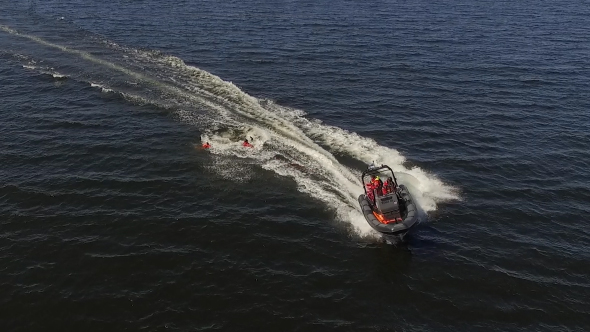
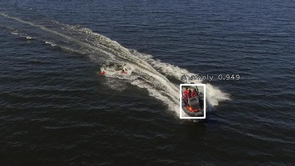
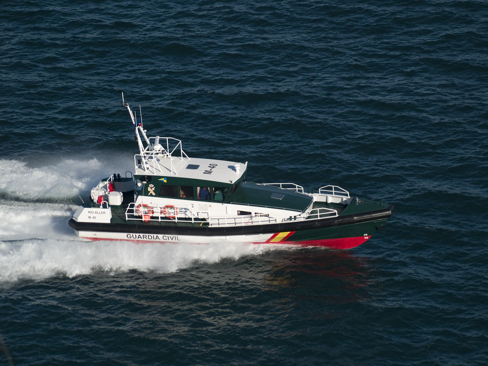

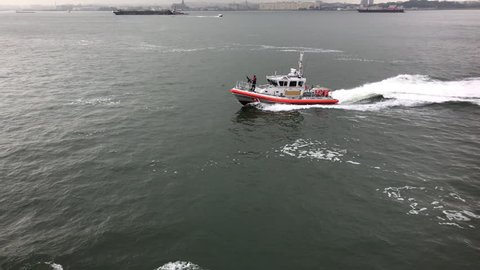
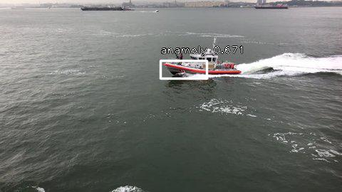
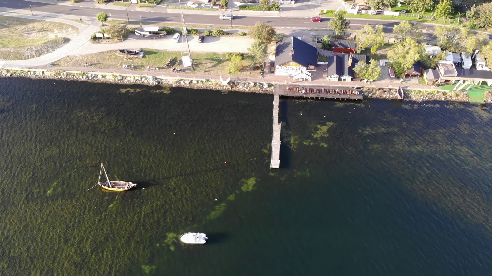
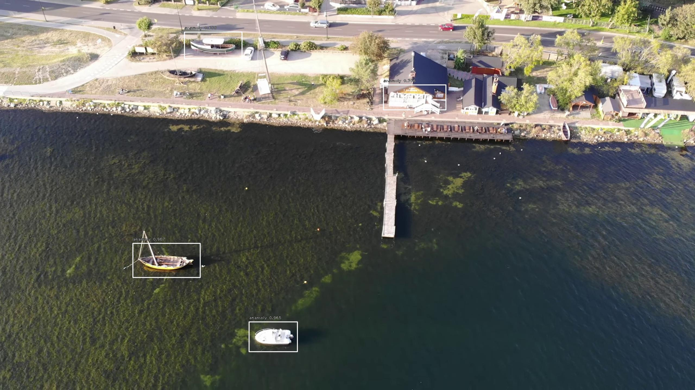
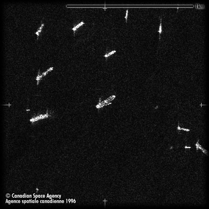
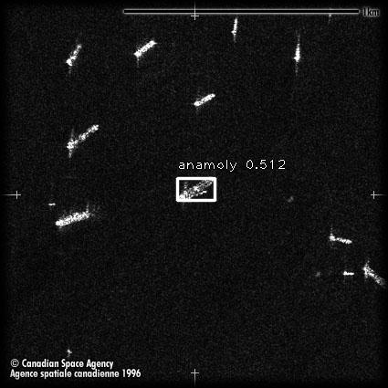
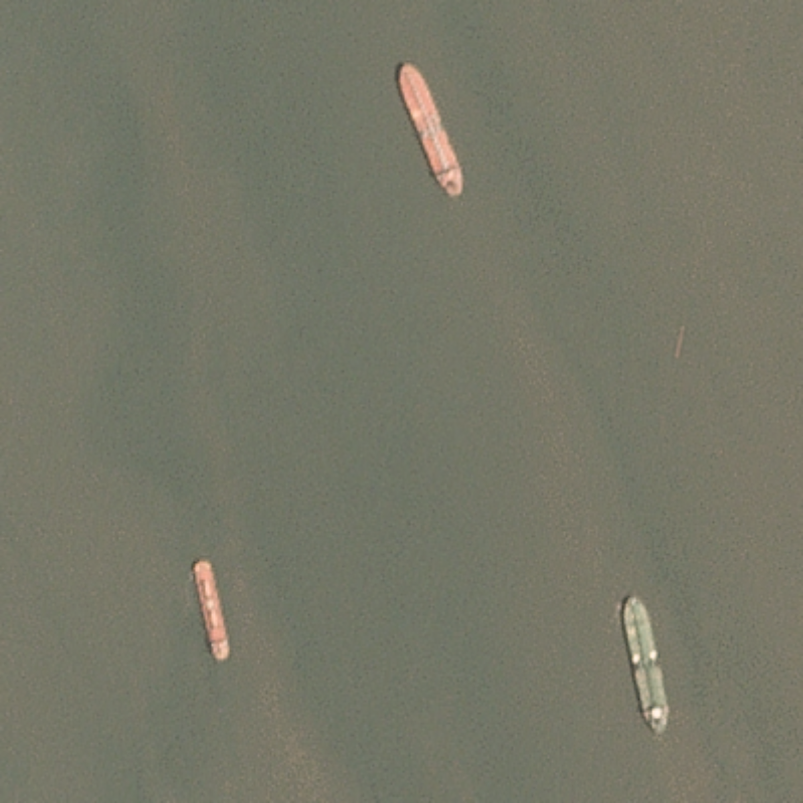
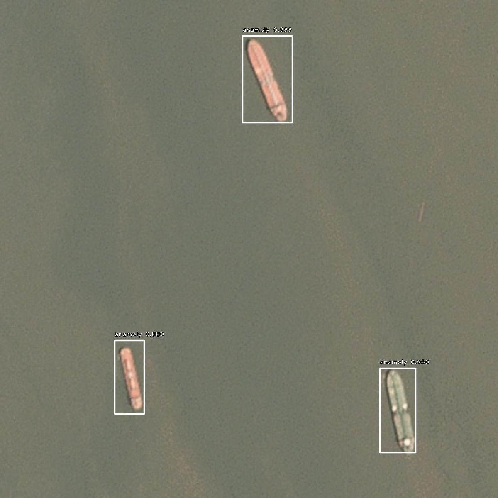

# Code
you can refer to the whole [driver code](Code/anomaly_detection_in_sar_imagery.ipynb) which follow all the sequence shown above for a better understanding and easier working.
